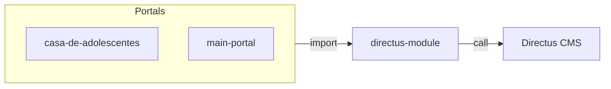

# Services and Modules

Portals are [Next.js](https://nextjs.org/) projects that uses the directus-module package in this monorepo to fetch data
from the [Directus CMS](https://directus.io/).

```mermaid
flowchart LR
    DirectusModule[directus-module]
    Directus[Directus CMS]

    subgraph Portals
        CasaDeAdolescentes[casa-de-adolescentes]
        MainPortal[main-portal]
    end

    Portals -->|import| DirectusModule

    DirectusModule -->|call| Directus
```
